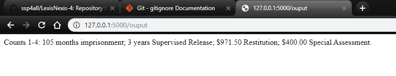
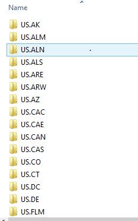
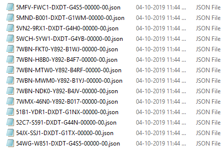
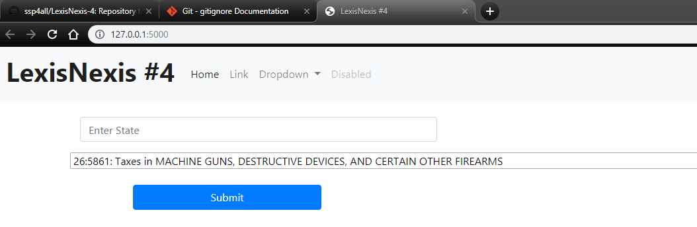

# LexisNexis-4
Repository to store code for problem statement #4

Problem Statement - Interested citizens want to know whether criminal defendants in a particular geographic area are getting tougher sentences for their crimes than criminal defendants elsewhere. Equality under the rule of law means that the law applies equally to everyone, regardless of where they live. Create a solution that reports on sentencing of federal criminal defendants according to geography. NOTE: Gender, race, and other demographics are not included in dockets and are outside the scope of this problem.

User input - Crime - textbox State - textbox

Based on the user input the output would be the states sentencing for a given crime .

### Images:

